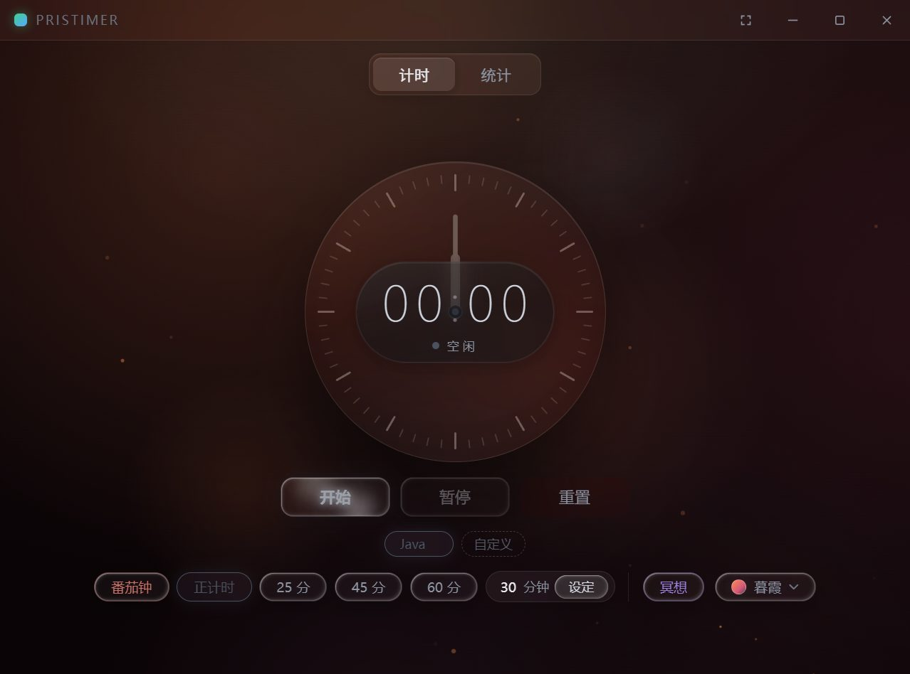
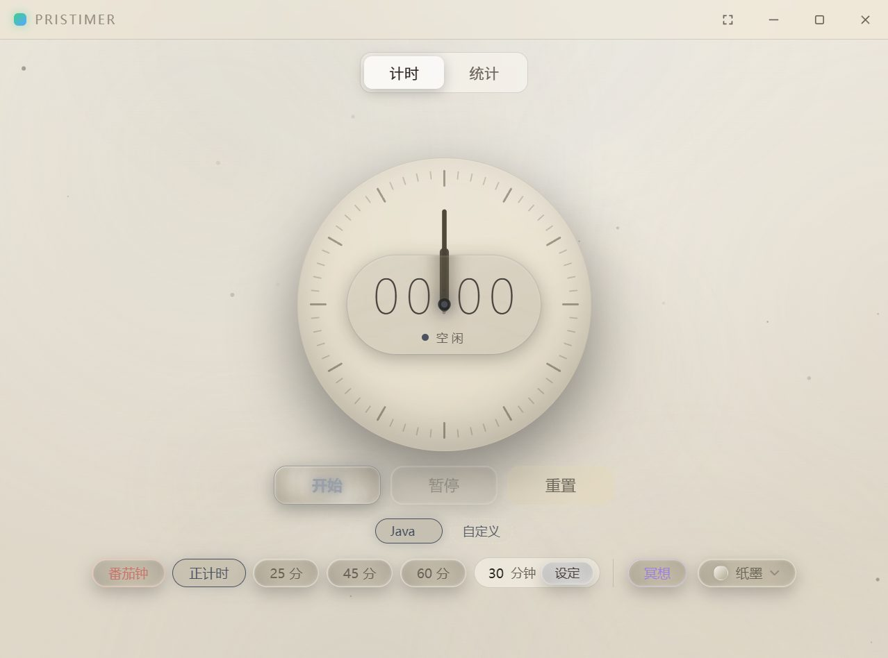

<div align="center">

# PrisTimer

**A liquid-glass desktop focus timer** · Tauri 2 + Rust + Vue 3

[](https://github.com/Prisdvl/PrisTimer/actions/workflows/ci.yml)
[](https://v2.tauri.app/)
[](https://www.rust-lang.org/)
[](https://vuejs.org/)
[](LICENSE)

*Anchored time, glass surfaces, six skies.* — An anchored timer engine, a glass interface, and six different skies.

[English](README.en.md) · [简体中文](README.md)


</div>

## ✨ Features

### Timer engine (`pristimer-core`)
- **Anchored timing model**: `elapsed = accumulated + (now − anchor)`. No cumulative counting, no drift
- **Dual-clock design**: `Instant` for in-process precision, `SystemTime` for persistence and cross-process recovery
- **Crash-safe**: anchors persisted in WAL mode; idempotent recovery after unexpected exits (gaps over 12h end as abnormal sessions, sessions under 10s are discarded)
- **Single-instance guard**: `CreateMutexW` + foreground-window pickup — launching twice just wakes the existing window

### Interface
- **Liquid-glass design system**: four-edge highlights + bottom refraction shadow + accent ambient rim light
- **Six themes** (Deep Sky / Void / Dawn / Aurora / Ember / Paper), interpolated via registered `@property` color tokens for a 0.9s silky transition; each theme has its own animated backdrop, and the dial hands, ticks and in-dial particles follow the theme (foreground and background luminance always move in opposite directions for legibility)

| Deep Sky | Void | Dawn | Aurora | Ember | Paper |
|---|---|---|---|---|---|
|  |  |  |  |  |  |

- **Mini widget**: a 264×96 always-on-top desk companion, animated with native `SetWindowPos` stepped transitions (pure vsync alignment, easeInOutCubic easing, no-op frames skipped)
- **Immersive mode & UI console**: hide the entire chrome with one click — clock and backdrop only; a ghost exit button (revealed on hover) or Esc brings it back; a bottom-right glass fab opens a console with four toggles to hide the tag bar / presets / side rail / hint strip, persisted across restarts
- **Dial particles**: while running, particles drift and connect inside the dial, bouncing off the rim along the surface normal; color follows the theme
- **Neon buttons** with layered breathing halos — the lit label always points at the next action
- **Scroll progress bar**: the right-side scrollbar is gone entirely; scroll position is a 2.5px strip along the top edge
- **Stats view**: yearly heatmap / hourly distribution / trend chart with rolling-number tweens, fully adapted to light themes; charts and tag selection use a constant accent color (never grayed out by the timer state)
- **Subject tags**: presets + custom entries, inline rename, daily goals
- **Pomodoro**: phase strip + draggable cycle-sequence cards (drag the long-break card to change rounds) + system notifications on phase change

| Running | Stats | Mini widget |
|---|---|---|
|  |  |  |

### Performance
- Animations are gated by visibility and form: mini mode freezes backdrop tweens, hidden pages pause their timelines, the particle canvas only starts while the timer runs
- **State-aware pacing**: while timing, the whole backdrop breathes at 1.5× (GSAP timeScale, no phase jumps)
- Layered backdrop density: breathing veil / theme dust / stardust & meteors — all animating only `transform` and `opacity` (GPU-composited properties)
- WebView2 glass compatibility: `cssTarget` is pinned to chrome120 so `backdrop-filter` keeps working

## 🏗 Architecture

```text
┌─────────────────────────────────────────────┐
│                src/ (Vue 3 + TS)            │
│   App.vue · AnalogDial · SmokeField · ...   │
└──────────────────┬──────────────────────────┘
                   │ Tauri IPC
┌──────────────────▼──────────────────────────┐
│         src-tauri/ (thin adapter)           │
│   recorder.rs · backup.rs · commands/*      │
└───────┬─────────────────────┬───────────────┘
        │                     │
┌───────▼────────┐   ┌────────▼─────────┐
│ pristimer-core │   │ pristimer-store  │
│ timer engine   │   │ SQLite storage   │
│ zero Tauri deps│   │ own session model│
└────────────────┘   └──────────────────┘
```

- `core` and `store` deliberately do not depend on each other: the engine's `TimerState` is an internal detail, while the store's `SessionKind/SessionState` is the database contract
- Backdrop animation is driven by GSAP (the only frontend runtime dependency), parameters read from CSS custom properties

## 🚀 Build & Run

Prerequisites: Node.js ≥ 20, Rust stable (MSVC toolchain), [Tauri 2 system dependencies](https://v2.tauri.app/start/prerequisites/)

```bash
npm install

# Development mode
npm run tauri dev

# Build installer (MSI on Windows)
npm run tauri build
```

## 📥 Download

Grab the latest MSI from the [Releases](https://github.com/Prisdvl/PrisTimer/releases) page. Pushing a `v*` tag triggers the release workflow, which builds the installer automatically.

## 📁 Project layout

```text
pristimer/
├── src/                  # Vue 3 frontend (components / glass.css tokens / composables)
├── src-tauri/            # Tauri thin adapter + packaging config
├── pristimer-core/       # Timer engine crate (pure Rust, unit tested)
├── pristimer-store/      # Persistence crate (rusqlite, integration tested)
└── docs/                 # Screenshots, icon sources
```

## License

[MIT](LICENSE)
