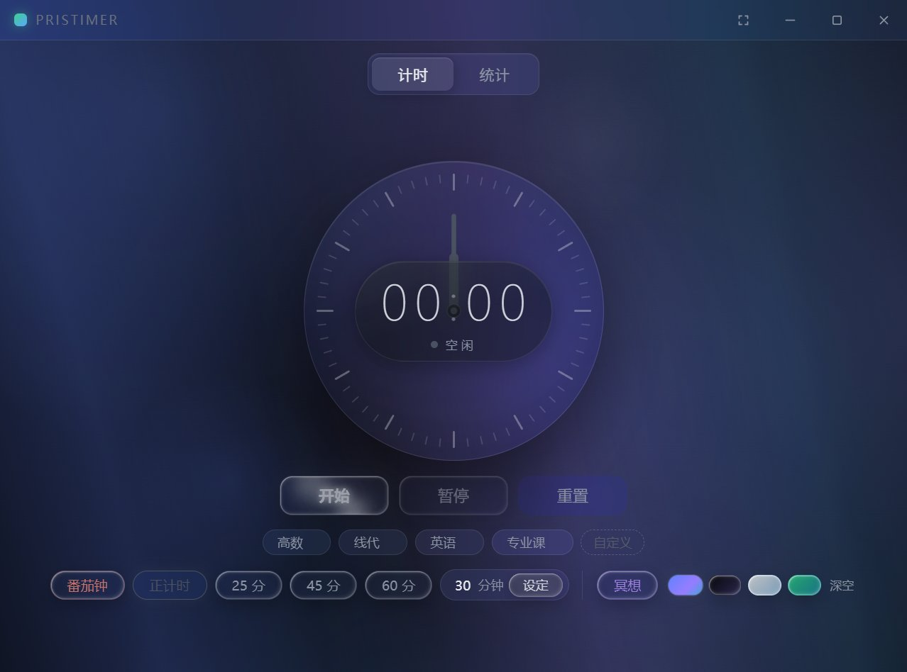
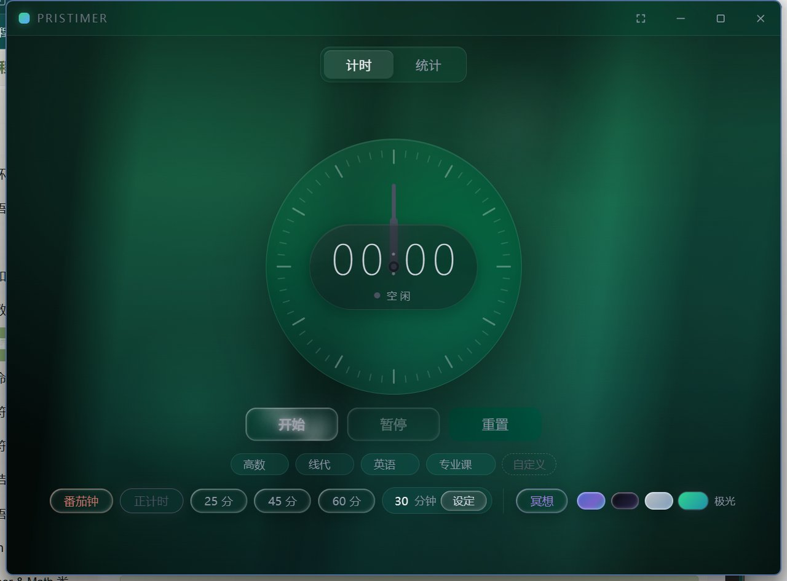
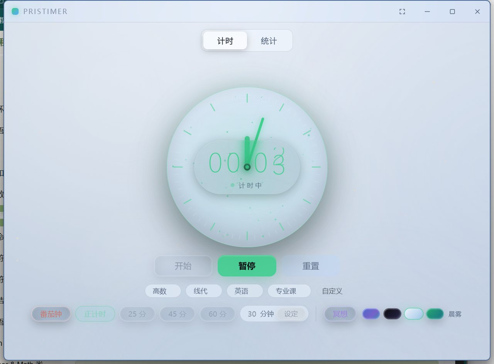
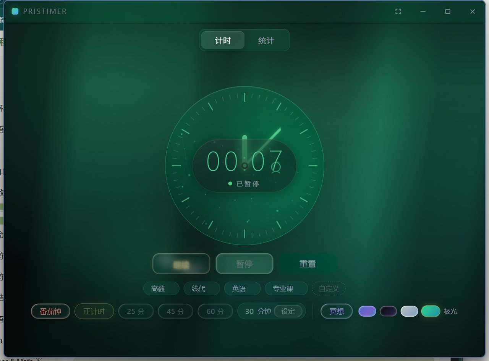
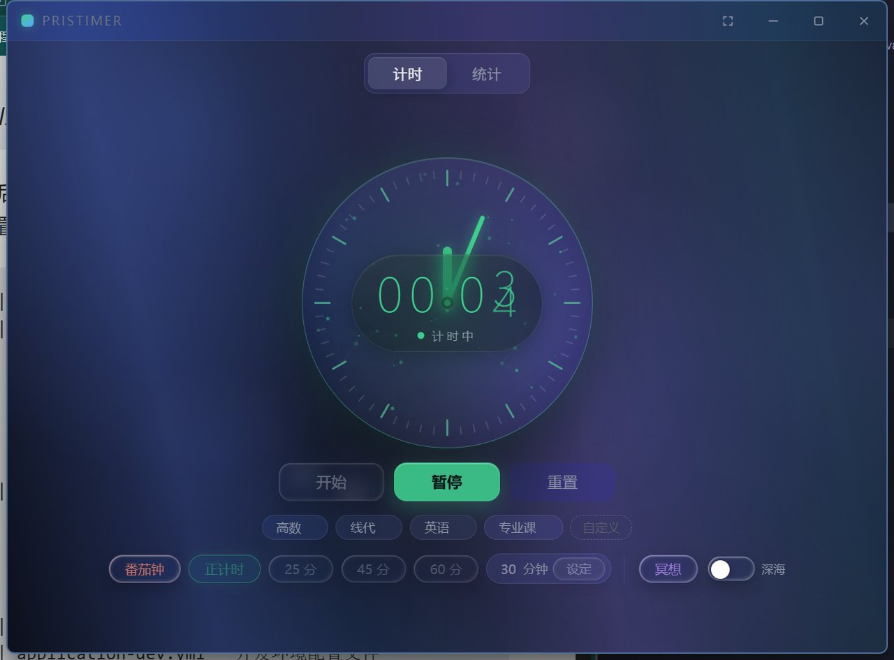
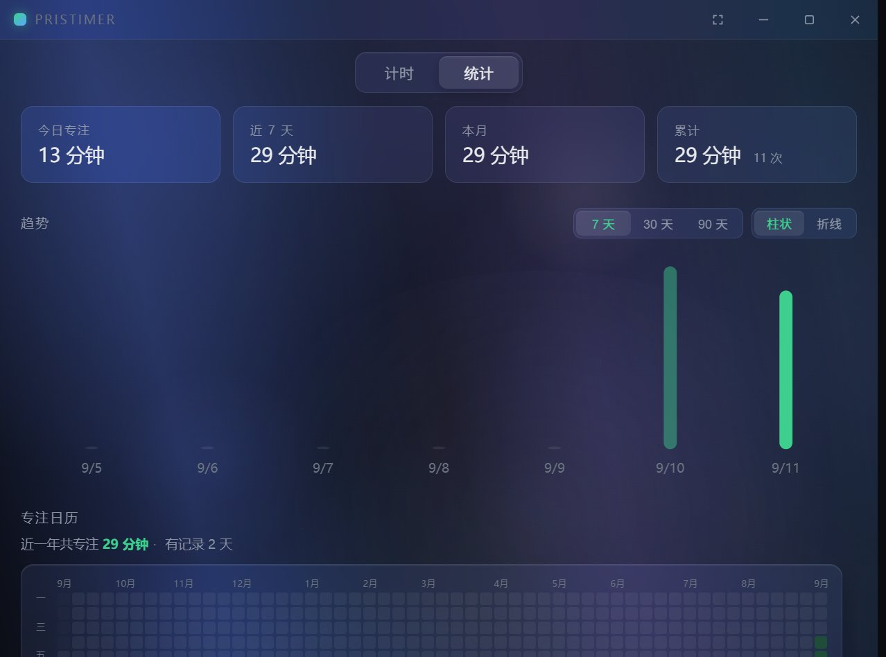
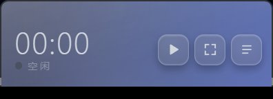

<div align="center">

# PrisTimer

**液态玻璃质感的桌面专注计时器** · Tauri 2 + Rust + Vue 3

[](https://v2.tauri.app/)
[](https://www.rust-lang.org/)
[](https://vuejs.org/)
[](LICENSE)

*Anchored time, glass surfaces, four skies.* — 锚定的计时引擎，玻璃的界面，四片不同的天空。



</div>

## ✨ 特性

### 计时引擎（`pristimer-core`）
- **锚点计时模型**：`elapsed = accumulated + (now − anchor)`，拒绝累加式计数，杜绝漂移
- **双时钟设计**：`Instant` 保证进程内精度，`SystemTime` 负责落库与跨进程恢复
- **崩溃安全**：WAL 模式持久化锚点；意外退出后恢复幂等（超 12h 间隔按异常结束，<10s 会话丢弃）
- **单实例守卫**：`CreateMutexW` + 前台窗口拾取，重复启动只会唤醒已有实例

### 界面
- **液态玻璃设计系统**：半透明面板 + 高光边 + 投影三件套，全局统一设计令牌
- **四套主题**，`@property` 颜色插值实现 0.9s 丝滑过渡，每套主题有专属背景动效

| 深空 | 虚空 | 晨雾 | 极光 |
|---|---|---|---|
|  |  |  |  |
| 斜向光带 | 星尘 + 流星 | 暖色光尘 | 纵向光幕 |

- **迷你置顶组件**：264×96 常驻桌面，原生 `SetWindowPos` 分帧动画（≤67fps，DwmFlush 对齐）平滑缩放
- **表盘粒子**：计时运行时粒子在盘面内漂移连线，出界沿法线反弹
- **霓虹按钮**：多层光晕呼吸，hover 点亮纯白，「亮着的字」永远指向下一个动作
- **顶部滚动进度条**：右侧滚动条整体取消，滚动位置由窗口顶缘 2.5px 细条表达
- **统计视图**：年度热力图 / 小时分布 / 趋势曲线，数字滚动补间

| 运行中 | 统计 | 迷你组件 |
|---|---|---|
|  |  |  |

### 性能
- 动画按可见性与形态门控：迷你态冻结背景补间、页面隐藏暂停时间线、粒子画布仅运行时启动
- WebView2 玻璃兼容：`cssTarget` 钉死 chrome120，防止 `backdrop-filter` 被改写前缀失效

## 🏗 架构

```text
┌─────────────────────────────────────────────┐
│                src/ (Vue 3 + TS)            │
│   App.vue · AnalogDial · SmokeField · ...   │
└──────────────────┬──────────────────────────┘
                   │ Tauri IPC
┌──────────────────▼──────────────────────────┐
│         src-tauri/（薄适配层）               │
│   recorder.rs（落库策略） · lib.rs（装配）    │
└───────┬─────────────────────┬───────────────┘
        │                     │
┌───────▼────────┐   ┌────────▼─────────┐
│ pristimer-core │   │ pristimer-store  │
│ 计时引擎        │   │ 持久化 (rusqlite) │
│ 零 Tauri 依赖   │   │ 自带会话模型      │
└────────────────┘   └──────────────────┘
```

- `core` 与 `store` 刻意互不依赖：引擎的 `TimerState` 是内部细节，store 的 `SessionKind/SessionState` 是数据库契约
- 背景动画由 GSAP 驱动（唯一前端运行时依赖），参数读 CSS 自定义属性

## 🚀 构建与运行

前置要求：Node.js ≥ 20、Rust stable（MSVC 工具链）、[Tauri 2 系统依赖](https://v2.tauri.app/start/prerequisites/)

```bash
npm install

# 开发模式
npm run tauri dev

# 构建安装包（Windows 产出 MSI）
npm run tauri build
```

## 📁 目录结构

```text
pristimer/
├── src/                  # Vue 3 前端（组件 / 样式令牌 glass.css / composables）
├── src-tauri/            # Tauri 薄适配层 + 打包配置
├── pristimer-core/       # 计时引擎 crate（纯 Rust，含单元测试）
├── pristimer-store/      # 持久化 crate（rusqlite，含集成测试）
└── docs/                 # 截图、图标源文件
```

## License

[MIT](LICENSE)
